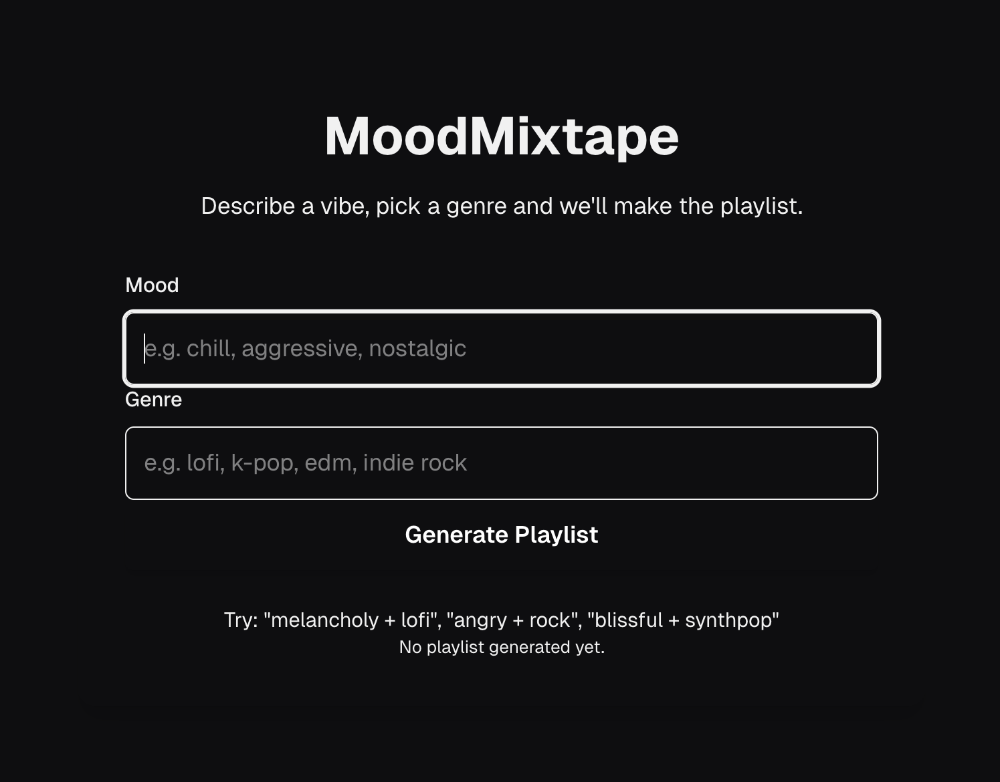
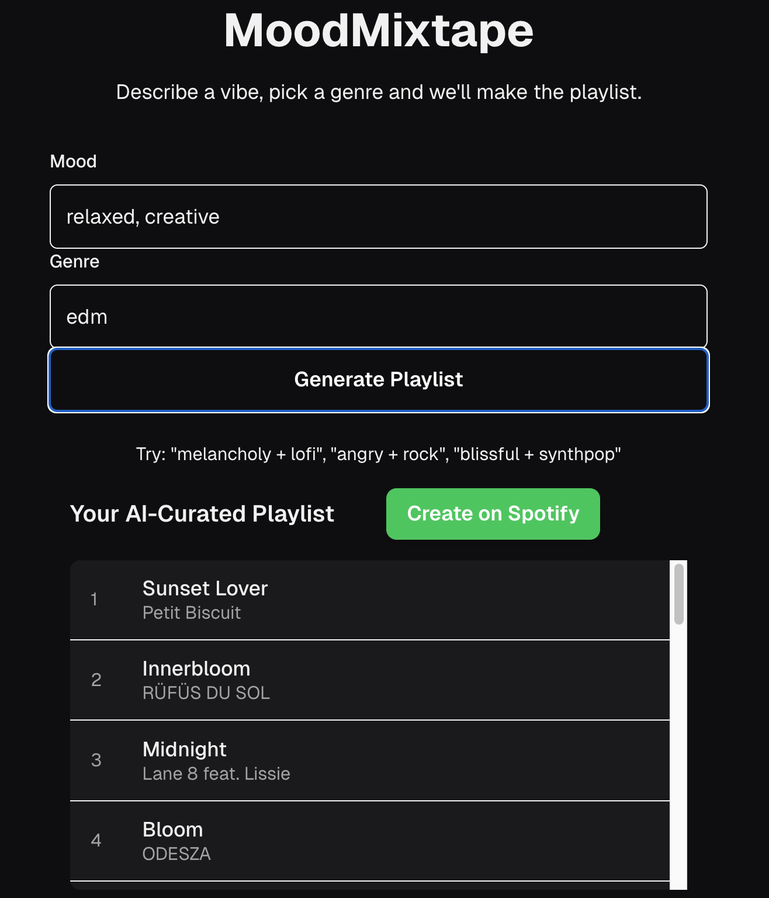
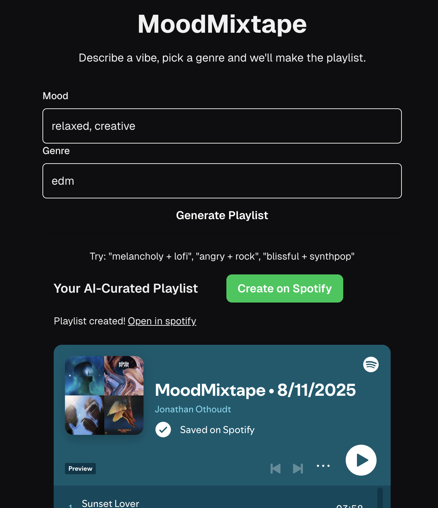

# 🎵 MoodMixtape(WIP)

>**AI-powered Spotify playlist generator** that curates tracks based on your mood, then creates and embeds them directly into your Spotify account.

## Demo

| 1. Enter mood & genre |  |
| 2. AI-curated results |  |
| 3. Created on Spotify |  |

## Overview

MoodMixtape lets you:
1. **Log in with Spotify** using a secure OAuth flow
2. **Generate an AI-curated playlist** from your mood and genre prompts
3. **Create the playlist in your Spotify account** automatically
4. **Embed & preview the playlist** right inside the app

Build with **Next.js**, **TypeScript**, **RTK Query**, and **NextAuth** for authentication.
Spotify integration uses the **Web API** with full support for refreshing access tokens.

---

## Features
- 🔐 **Spotify OAuth Login** with automatic token refresh  
- 🎯 **AI-curated playlists** based on song list or mood  
- 📋 Playlist **create + save** directly to your Spotify account  
- 🎨 **Responsive design** with Tailwind CSS  
- ⚡ Instant **playlist embed** for quick listening  
- 🛡 Strict **type safety** 
- 🔄 Handles **token expiration** automatically

---

## 🛠 Tech Stack

- **Client:** Next.js (App Router), React 19, TypeScript, Tailwind CSS, NextAuth.js, RTK Query
- **API:** Express 5, Zod, Axios, OpenAI SDK, express-rate-limit
- **Monorepo:** Yarn Workspaces + Turborepo

**Frontend & Server**:
- [Next.js 14+ (App Router)](https://nextjs.org/)  
- [React 19](https://react.dev/)  
- [TypeScript](https://www.typescriptlang.org/)  
- [Tailwind CSS](https://tailwindcss.com/)  

**Auth**:
- [NextAuth.js](https://next-auth.js.org/) with **Spotify Provider**  

**State Management & API**:
- [RTK Query](https://redux-toolkit.js.org/rtk-query/overview)  

**Integration**:
- [Spotify Web API](https://developer.spotify.com/documentation/web-api/)  
- [OpenAI/ChatGPT API](https://platform.openai.com/docs)
---

## 🚀 Getting Started

### 1 Clone the repo && install
```bash
git clone https://github.com/yourusername/mood-mixtape.git
cd mood-mixtape
yarn install
```

## 2. Create a Spotify App
Go to Spotify Developer Dashboard
Create a new app
Set your Redirect URI to:
```
https://127.0.0.1:3000/api/auth/callback/spotify
```
(Spotify does not allow localhost)

## 3. Environment Variables
Create .env.local in /client

```
# Spotify credentials
SPOTIFY_CLIENT_ID=your_spotify_client_id
SPOTIFY_CLIENT_SECRET=your_spotify_client_secret

# NextAuth
NEXTAUTH_SECRET=super-secret-key
NEXTAUTH_URL=http://127.0.0.1:3000
```
```
NEXT_PUBLIC_API_BASE_URL=http://localhost:4000
```

api/env:
# OpenAI key (used by the Express API)
OPEN_API_KEY=sk-...

# Optional (default is https://api.spotify.com/v1)
SPOTIFY_API_BASE_URL=https://api.spotify.com/v1

# CORS (must match the client origin you actually use)
CORS_ORIGIN=http://127.0.0.1:3000

PORT=4000

App will be available at: http://127.0.0.1:3000

## Usage Tips
- When you click "Create on Spotify" while logged out, the app:
 1. Saves { mood, genre, songs } to localStorage
 2. Redirects to Spotify consent via Next Auth
 3. Returns to the same page and restores your list

## Scripts
- From the repo root:

- yarn dev - run Next + API in parallel via Turborepo
- yarn build - build all packages
- yarn start - run built apps (Express on 4000, Next on 3000)
- yarn lint/yarn typecheck - quality checks

## ⚠️ Notes

- Spotify embed playback may be restricted by browser **third-party cookie** settings.  
  - If playback doesn’t start inside the embed, try **allowing third-party cookies for `open.spotify.com`** in your browser settings.  
  - Alternatively, click “Open in Spotify” to launch the playlist in a new tab.
- Redirect URIs **must** match exactly between your `.env.local` and Spotify dashboard.
- For local development, HTTP works fine (`http://127.0.0.1:3000`) — HTTPS is only required for production.
